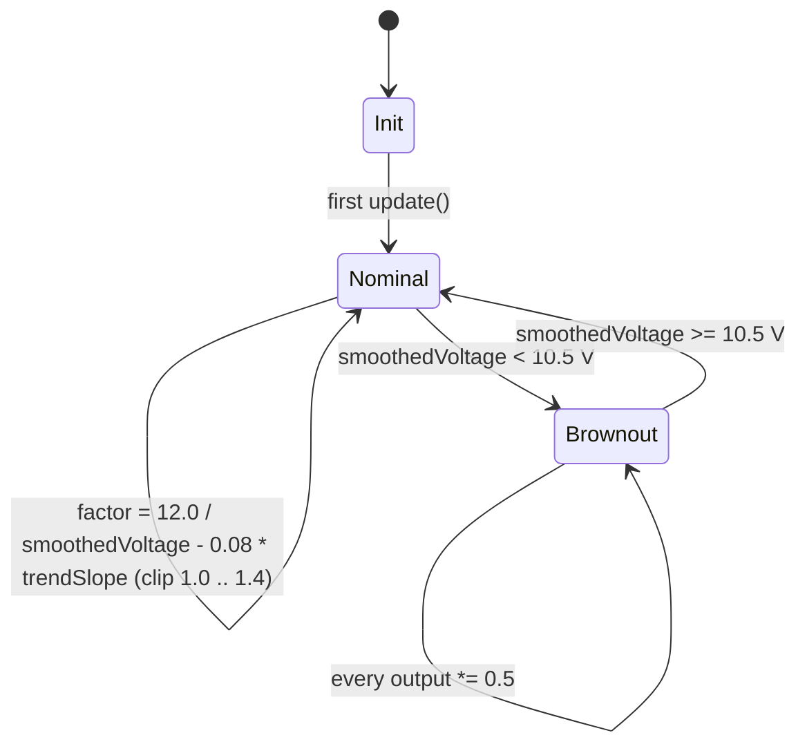
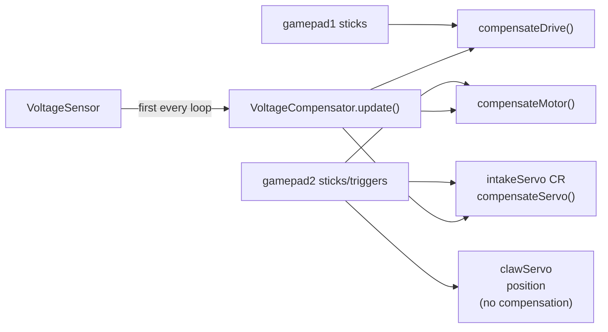

# Architecture — `ftc-voltage-compensator`

This document is the single source of truth for **how**
`VoltageCompensator` behaves at runtime.  Read it before tuning in
practice; read [CONTRIBUTING.md](CONTRIBUTING.md) before changing
the public API; read [SECURITY.md](SECURITY.md) before making
changes that affect the security posture.

## What problem are we solving?

FTC robots run on a 12 V lead-acid battery whose voltage sags under
load.  A nominally-commanded `setPower(0.5)` to a motor means
different things at 13.0 V (a fresh pack mid-match) vs 10.0 V (under
load at the end of a long auto run).  Without compensation:

* Drive-train feel drifts as the match progresses.
* Motors can brown out the Control Hub mid-cycle.
* Servo jitter becomes more pronounced at low voltage.

`VoltageCompensator` runs in the op-mode loop, reads the battery
voltage from the Control Hub's `VoltageSensor`, smooths it, and
multiplies every motor/servo command by a factor that normalises
torque back to the nominal 12 V reference.

## The two states



The state is **fully determined by the most recent smoothed voltage**:

* `smoothedVoltage >= 10.5 V` → **Nominal** (compensated output, no cap).
* `smoothedVoltage <  10.5 V` → **Brownout** (output halved; factor still
  computed, but the 0.5 multiplier dominates).

`compensationFactor` itself is always in `[1.0, MAX_SAG_COMPENSATION]`,
i.e. `[1.0, 1.4]`.  Below nominal voltage, the factor grows linearly; the
hard ceiling at 1.4 prevents the factor from commanding dangerously
high motor currents when the battery is severely depleted.

## Per-loop interaction

`update()` must be called **once per loop iteration, before any
compensate*()` call**.  The compensator has no internal loop of its own;
it's a pure function of the latest sensor reading + the smoothing
circular buffers.

```mermaid
sequenceDiagram
    autonumber
    participant OpMode as opMode loop
    participant VC as VoltageCompensator
    participant Sensor as VoltageSensor

    OpMode->>VC: update(sensor, telemetry?)
    VC->>Sensor: getVoltage()
    Sensor-->>VC: rawVoltage
    VC->>VC: rolling avg over ROLLING_WINDOW_SIZE = 20 samples
    VC->>VC: append to trend buffer; recompute linear-regression slope
    VC->>VC: factor = 12.0 / smoothed - 0.08 * trendSlope, clip [1.0, 1.4]
    OpMode->>VC: compensateDrive(rawPower)
    VC-->>OpMode: rawPower (with cubic curve) * factor, halved if brownout
    OpMode->>VC: compensateMotor(rawPower)
    VC-->>OpMode: rawPower * factor, halved if brownout
    OpMode->>VC: compensateServo(rawPower)
    VC-->>OpMode: rawPower * factor(but clipped to [1.0, 1.15]), halved if brownout
```

## Key constants and why

| Constant                  | Value | Why                                                               |
|---------------------------|-------|-------------------------------------------------------------------|
| `NOMINAL_VOLTAGE`         | 12.0  | Fresh 12 V lead-acid; design reference for torque normalisation. |
| `BROWNOUT_THRESHOLD`      | 10.5  | Below this the Control Hub is at risk of browning out itself; halve the output to ride through. |
| `MAX_SAG_COMPENSATION`    | 1.4   | Hard ceiling on the per-axis multiplier; prevents commanding >40 % boost at very low voltage. |
| `MAX_SERVO_COMPENSATION`  | 1.15  | Continuous-rotation servos jitter when over-driven; tighter cap.  |
| `ROLLING_WINDOW_SIZE`     | 20    | ~0.66 s smoothing at 30 Hz loop rate.  Higher = more lag, less jitter. |
| `TREND_WINDOW_SIZE`       | 100   | ~3.3 s of smoothed samples for the linear-regression slope.       |
| `TREND_CORRECTION_GAIN`   | 0.08  | How much the predictive trend nudges the factor.  Low to avoid oscillation on noisy slopes. |
| 30 Hz (loop rate)         | —     | Hard-coded `SAMPLES_PER_SECOND` for slope → V/sec conversion.  Adjust for faster loops. |

## Compensation paths

A single op-mode typically mixes three output channels, each with a
different compensating path:

| Channel                   | Method              | Curve applied? | Cap applied? | Brownout halved? |
|---------------------------|---------------------|----------------|--------------|------------------|
| Mecanum drive (low speed) | `compensateDrive`   | yes (cubic)    | yes          | yes              |
| Non-drive DC motor        | `compensateMotor`   | no             | yes          | yes              |
| Continuous-rotation servo | `compensateServo`   | no             | yes (tighter) | yes             |
| Position servo (claw)     | **NOT compensated** | —              | —            | —                |

Position servos have an internal PID that handles voltage variation
itself; multiplying the command input by a voltage factor would
double-correct and cause jitter.

## Integration with `VoltageCompensatedTeleOp`



Note the **single-call-update** discipline: `VC.update(...)` is invoked
exactly once per loop iteration, before any `compensate*()` call so the
internal state is fresh.

## Tuning recipe

1. Measure voltages during a typical match with telemetry visible.
2. **Raise** `BROWNOUT_THRESHOLD` if the robot browns out before your
   nominal end-of-match voltage.  A higher threshold engages the
   half-power protection earlier; a lower threshold *delays* it and
   makes brownouts *more* likely.
3. Lower `MAX_SAG_COMPENSATION` if you see motor-amp trips in low
   voltage (the 1.4× limit is the highest "safe" form factor; 1.25×
   may already be too aggressive for some 12 V gearmotors).
4. Raise `ROLLING_WINDOW_SIZE` if you see jitter in the telemetry line
   (but expect a lag penalty: smoothed voltage takes longer to react
   to a sudden load).
5. Lower `TREND_CORRECTION_GAIN` to disable the predictive sag
   pre-emption entirely (set to 0.0 for the most conservative
   driving).  Raising it amplifies noisy slopes — keep it low
   unless you have a stable pack and want the extra boost.

## Cross-references

* [CONTRIBUTING.md](CONTRIBUTING.md) — public API stability and coding
  style (Java 8 source features only).
* [SECURITY.md](SECURITY.md) — supported versions, reporting, and the
  GitHub Actions / wrapper SHA-256 / no-dependabot hardening story.
* [CHANGELOG.md](CHANGELOG.md) — one entry per release.
