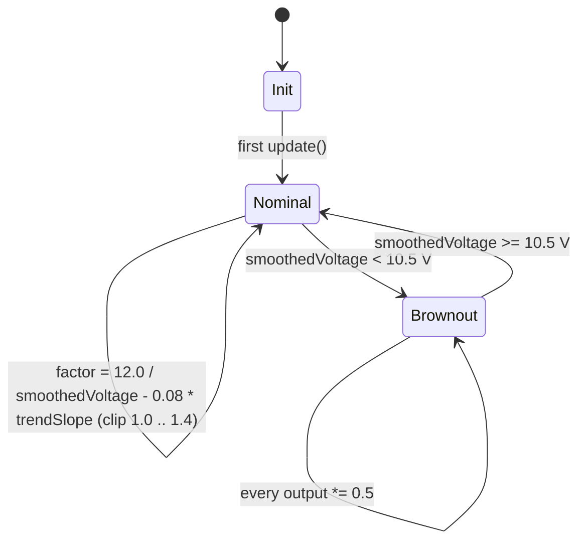
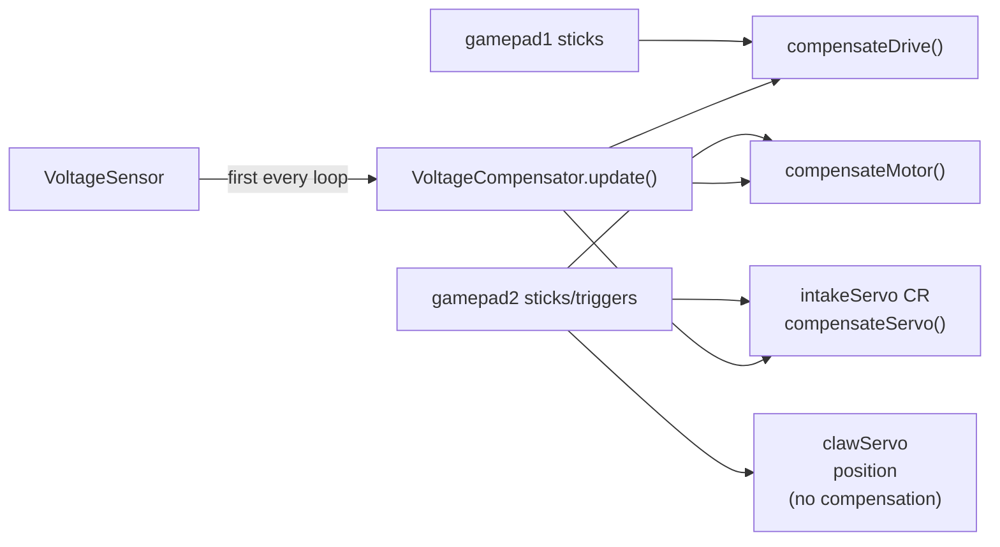

# Architecture — `ftc-voltage-compensator`

This document is the single source of truth for **how**
`VoltageCompensator` behaves at runtime.  Read it before tuning in
practice; read [CONTRIBUTING.md](CONTRIBUTING.md) before changing
the public API; read [SECURITY.md](SECURITY.md) before making
changes that affect the security posture.

## What problem are we solving?

FTC robots run on a 12 V lead-acid battery whose voltage sags under
load.  A nominally-commanded `setPower(0.5)` to a motor means
different things at 13.0 V (a fresh pack mid-match) vs 10.0 V (under
load at the end of a long auto run).  Without compensation:

* Drive-train feel drifts as the match progresses.
* Motors can brown out the Control Hub mid-cycle.
* Servo jitter becomes more pronounced at low voltage.

`VoltageCompensator` runs in the op-mode loop, reads the battery
voltage from the Control Hub's `VoltageSensor`, smooths it, and
multiplies every motor/servo command by a factor that normalises
torque back to the nominal 12 V reference.

## The two states



The state is **fully determined by the most recent smoothed voltage**:

* `smoothedVoltage >= 10.5 V` → **Nominal** (compensated output, no cap).
* `smoothedVoltage <  10.5 V` → **Brownout** (output halved; factor still
  computed, but the 0.5 multiplier dominates).

`compensationFactor` itself is always in `[1.0, MAX_SAG_COMPENSATION]`,
i.e. `[1.0, 1.4]`.  Below nominal voltage, the factor grows linearly; the
hard ceiling at 1.4 prevents the factor from commanding dangerously
high motor currents when the battery is severely depleted.

## Per-loop interaction

`update()` must be called **once per loop iteration, before any
compensate*()` call**.  The compensator has no internal loop of its own;
it's a pure function of the latest sensor reading + the smoothing
circular buffers.

```mermaid
sequenceDiagram
    autonumber
    participant OpMode as opMode loop
    participant VC as VoltageCompensator
    participant Sensor as VoltageSensor

    OpMode->>VC: update(sensor, telemetry?)
    VC->>Sensor: getVoltage()
    Sensor-->>VC: rawVoltage
    VC->>VC: rolling avg over ROLLING_WINDOW_SIZE = 20 samples
    VC->>VC: append to trend buffer; recompute linear-regression slope
    VC->>VC: factor = 12.0 / smoothed - 0.08 * trendSlope, clip [1.0, 1.4]
    OpMode->>VC: compensateDrive(rawPower)
    VC-->>OpMode: rawPower (with cubic curve) * factor, halved if brownout
    OpMode->>VC: compensateMotor(rawPower)
    VC-->>OpMode: rawPower * factor, halved if brownout
    OpMode->>VC: compensateServo(rawPower)
    VC-->>OpMode: rawPower * factor(but clipped to [1.0, 1.15]), halved if brownout
```

## Key constants and why

The "Why" column also doubles as the table of contents for the
[Tuning recipe](#tuning-recipe) section below: every tunable constant
ends with a *see [Tuning recipe §N]* link so a tuner does not have
to scroll-hunt.  `NOMINAL_VOLTAGE` and `30 Hz (loop rate)` are not
tunable knobs (the former is the design reference voltage; the
latter is `VoltageCompensator.computeLinearRegressionSlope`'s
hard-coded `SAMPLES_PER_SECOND` constant).

| Constant                  | Value | Why                                                                          |
|---------------------------|-------|------------------------------------------------------------------------------|
| `NOMINAL_VOLTAGE`         | 12.0  | Fresh 12 V lead-acid; design reference for torque normalisation. *(Not a tuning knob — match your battery chemistry.)* |
| `BROWNOUT_THRESHOLD`      | 10.5  | Below this the Control Hub is at risk of browning out itself; halve the output to ride through. *See [Tuning recipe §1](#tuning-recipe).* |
| `MAX_SAG_COMPENSATION`    | 1.4   | Hard ceiling on the per-axis multiplier; prevents commanding >40 % boost at very low voltage. *See [Tuning recipe §2](#tuning-recipe).* |
| `MAX_SERVO_COMPENSATION`  | 1.15  | Continuous-rotation servos jitter when over-driven; tighter cap. *See [Tuning recipe §3](#tuning-recipe).* |
| `ROLLING_WINDOW_SIZE`     | 20    | ~0.66 s smoothing at 30 Hz loop rate.  Higher = more lag, less jitter. *See [Tuning recipe §4](#tuning-recipe).* |
| `TREND_WINDOW_SIZE`       | 100   | ~3.3 s of smoothed samples for the linear-regression slope. *See [Tuning recipe §5](#tuning-recipe).* |
| `TREND_CORRECTION_GAIN`   | 0.08  | How much the predictive trend nudges the factor.  Low to avoid oscillation on noisy slopes. *See [Tuning recipe §6](#tuning-recipe).* |
| 30 Hz (loop rate)         | —     | Hard-coded `SAMPLES_PER_SECOND` for slope → V/sec conversion.  Adjust for faster loops. *(Not a tuning constant — change the constant in `VoltageCompensator.java`.)* |

## Compensation paths

A single op-mode typically mixes three output channels, each with a
different compensating path:

| Channel                   | Method              | Curve applied? | Cap applied? | Brownout halved? |
|---------------------------|---------------------|----------------|--------------|------------------|
| Mecanum drive (low speed) | `compensateDrive`   | yes (cubic)    | yes          | yes              |
| Non-drive DC motor        | `compensateMotor`   | no             | yes          | yes              |
| Continuous-rotation servo | `compensateServo`   | no             | yes (tighter) | yes             |
| Position servo (claw)     | **NOT compensated** | —              | —            | —                |

Position servos have an internal PID that handles voltage variation
itself; multiplying the command input by a voltage factor would
double-correct and cause jitter.

## Integration with `VoltageCompensatedTeleOp`



Note the **single-call-update** discipline: `VC.update(...)` is invoked
exactly once per loop iteration, before any `compensate*()` call so the
internal state is fresh.

## Tuning recipe

For each constant, decide which direction to move from the defaults
shipped in `VoltageCompensator.java`, and why.  The defaults are tuned
for a typical 12 V lead-acid pack at 30 Hz loop rate; bespoke teams
will have one or two constants they want to nudge.

1. **BROWNOUT_THRESHOLD** (default 10.5 V) — voltage below which every
   output is halved.
   - **Raise** (e.g. 11.0 V) if the robot browns out before your
     nominal end-of-match voltage; half-power protection kicks in
     earlier.
   - **Lower** (e.g. 9.5 V) only if motors feel sluggish on a fresh
     pack AND your pack stays above the lower limit all match long.
     Going too low re-introduces the brownout risk we're protecting
     against.

2. **MAX_SAG_COMPENSATION** (default 1.4×) — hard ceiling on per-axis
   boost.
   - **Lower** (e.g. 1.25×) if you see motor-amp trips in low voltage;
     the 1.4× limit is the highest "safe" form factor for typical
     12 V gearmotors.
   - **Raise** sparingly (e.g. 1.5×) only if you have measured motor
     thermal headroom; >1.4× risks burning motors.

3. **MAX_SERVO_COMPENSATION** (default 1.15×) — same idea for continuous-
   rotation servos, tighter cap because position servos jitter when
   over-driven.
   - **Lower** (e.g. 1.05×) if you see CR-servo jitter at low voltage.
   - **Raise** (e.g. 1.20×) only if your CR servo feels under-powered
     on a sagging pack; >1.25× re-introduces the jitter we're capping
     against.

4. **ROLLING_WINDOW_SIZE** (default 20 — ~0.66 s at 30 Hz) — length of
   the rolling-average circular buffer.
   - **Raise** (e.g. 50) for a smoother voltage line in telemetry.
   - **Lower** (e.g. 10) for faster reaction to a sudden load.
   - Trade-off: more smoothing hides single-sample noise, but adds
     lag on a fast transient.

5. **TREND_WINDOW_SIZE** (default 100 — ~3.3 s at 30 Hz) — length of the
   linear-regression buffer used to compute the trend slope.
   - **Raise** for a more stable slope estimate (less volatile when
     a single noisy sample lands close to the tail).
   - **Lower** for a slope that updates more aggressively.

6. **TREND_CORRECTION_GAIN** (default 0.08) — predictive boost based on
   the trend slope.
   - **Lower** (e.g. 0.04) for a smoother but slower-sag pre-emption.
   - **Raise** (e.g. 0.12) for a more aggressive but noisier
     pre-emption.
   - Set to 0.0 to disable trend correction entirely; the
     compensator then becomes a pure rolling-average follower.

Always validate a tuning change in a 5-minute driving session with
telemetry visible before committing; the constants interact and a
change in one often requires a counter-change in another.

## Cross-references

* [CONTRIBUTING.md](CONTRIBUTING.md) — public API stability and coding
  style (Java 8 source features only).
* [SECURITY.md](SECURITY.md) — supported versions, reporting, and the
  GitHub Actions / wrapper SHA-256 / no-dependabot hardening story.
* [CHANGELOG.md](CHANGELOG.md) — one entry per release.
